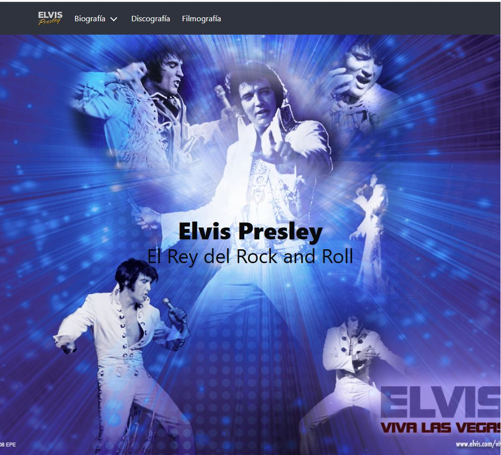
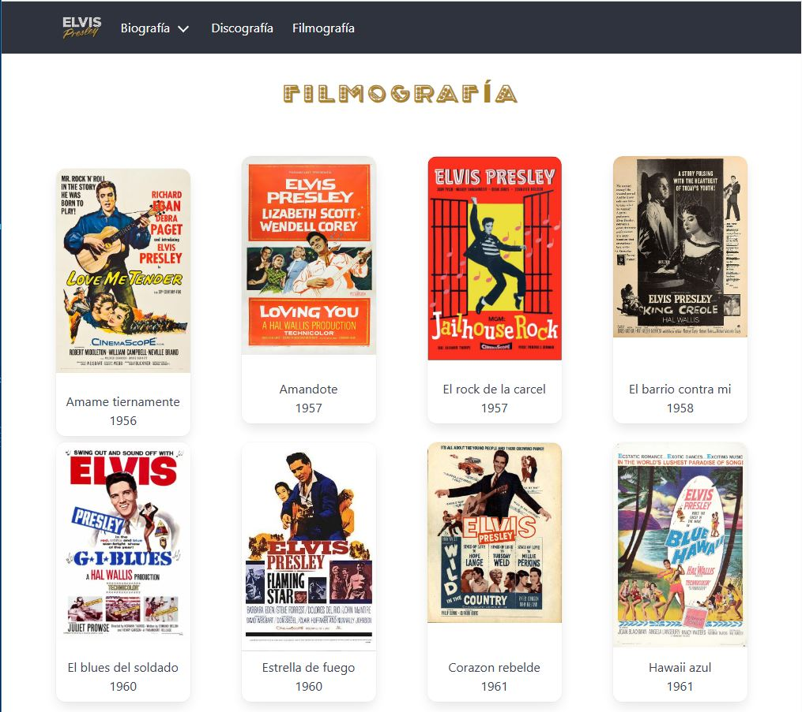

# Elvis Presley – Landing Page (Bulma)

Landing page informativa dedicada a **Elvis Presley**, desarrollada como ejercicio práctico utilizando el framework **Bulma CSS**.  
El sitio presenta una biografía completa, discografía, filmografía y navegación con menú hamburguesa y dropdown.

---

## 🚀 Demo

👉 [Ver sitio en vivo](https://elvis-presley-bulma-ada202507.vercel.app/)  

---

## 📸 Capturas de pantalla

  
  
  

---

## 🛠️ Tecnologías utilizadas

- HTML5  
- Bulma CSS (CDN)  
- CSS personalizado  
- JavaScript (vanilla)

---

## ✨ Funcionalidades

- ✅ Diseño responsive (mobile, tablet y desktop)
- ✅ Navbar fija con menú hamburguesa
- ✅ Dropdown en sección Biografía
- ✅ Scroll por secciones
- ✅ Galería de discografía (cards)
- ✅ Galería de filmografía (cards)
- ✅ Estilos personalizados sobre Bulma

---

## 📌 Notas

- Proyecto realizado como práctica con **Bulma CSS**
- No utiliza frameworks de JavaScript
- Todas las interacciones están hechas con JS vanilla

---

## 👩‍💻 Autor

Desarrollado por **Stella Maris Loreto**
